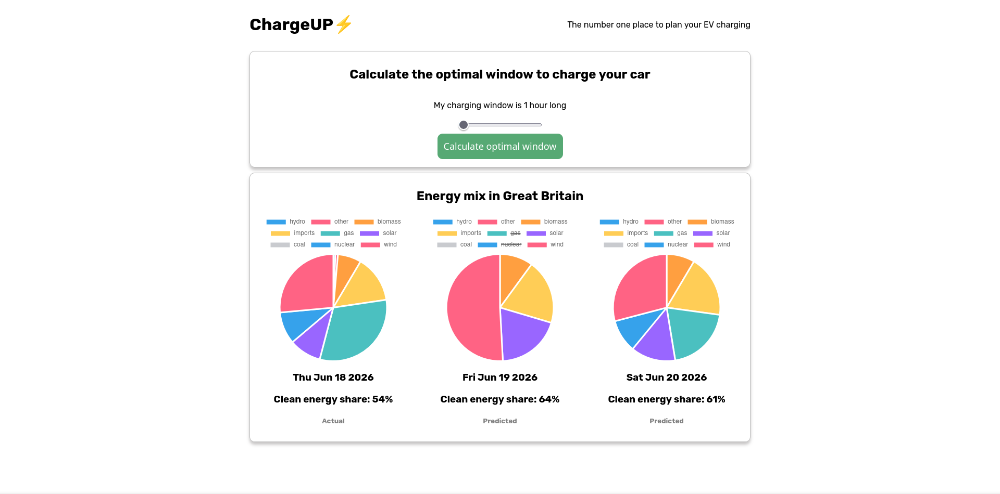
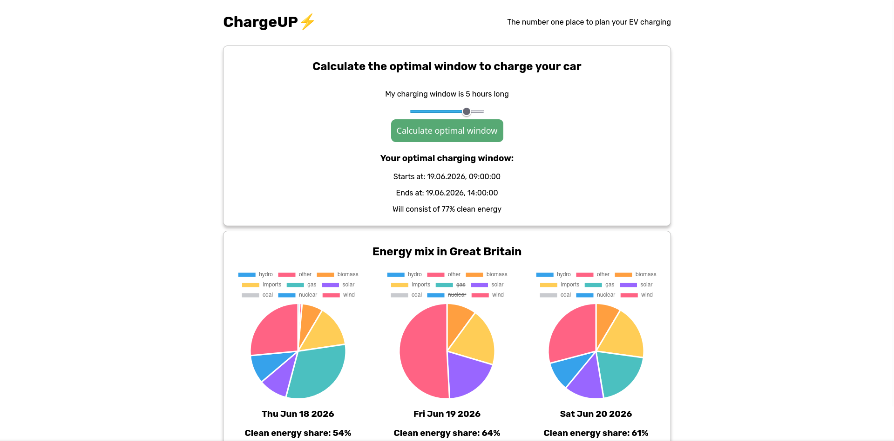

# ChargeUP Frontend
Frontend for my [ChargeUP backend](https://github.com/Eukon05/chargeup) app.

## Live demo
You can check out the working demo of the project at:  
https://chargeup-frontend.onrender.com/

## Functionality
ChargeUP is an EV charging optimization app.  
Based on data about the energy mix in Great Britain, it can calculate an optimal window of time in the next two days, when the energy mix there has the highest share of clean energy sources available.  
The user can specify how long their charging window is, and the app will calculate an optimal window of that length.  

Additionally, the app displays pie charts of the current energy mix in GB, and predictions for the next two days.  

## Tech stack
The following technologies have been used in this project:
- HTML + CSS + TypeScript
- React
- [Chart JS](https://www.chartjs.org/docs/latest/) + [react-chartjs-2](https://react-chartjs-2.js.org/)
- npm
- Vite

The data for GB's energy mix is being sourced from:  
https://carbon-intensity.github.io/api-definitions/?shell#get-generation-from-to
